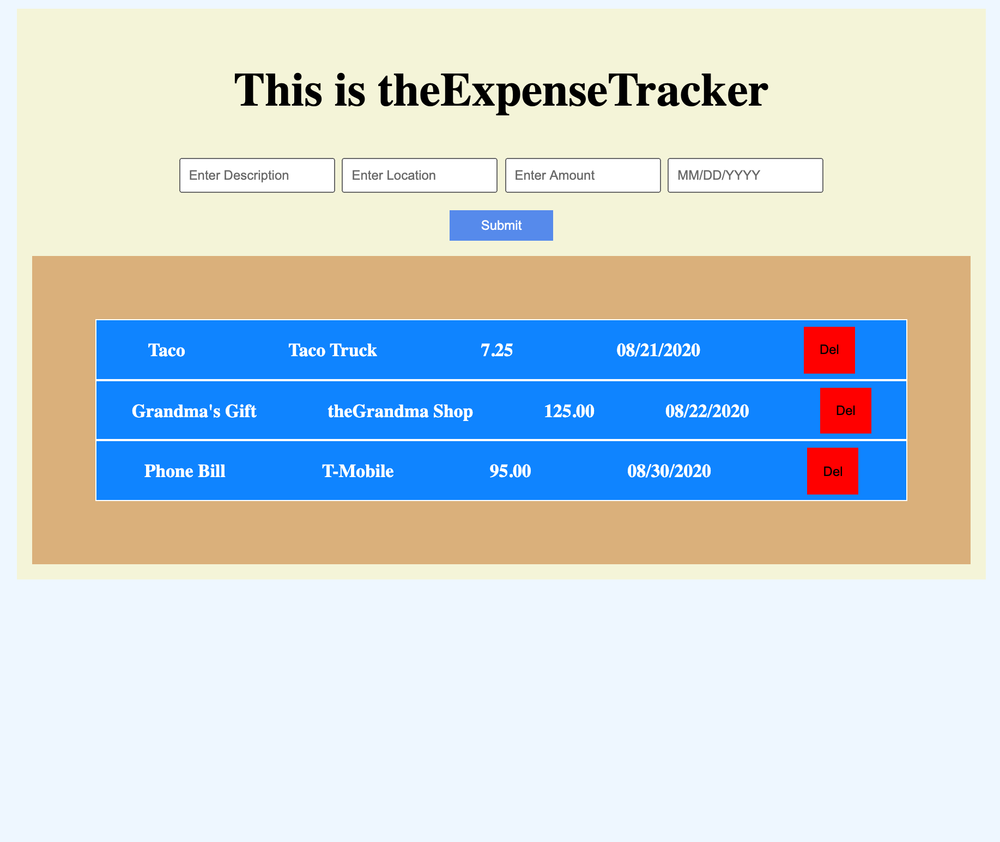

# theVanilla Expense Tracker App

HTML, CSS, JS

User has the ability to add a new expense and to delete an expense if desired. The inputs are desc, location, amount, and date.

<small>Live Link: https://thevanillaexpensetrackerapp.netlify.app/</small>

<h2>Summary</h2>

I wanted to keep practicing my skills and use class to create another classic application. I used the class constructor to create an expense tracker. 
I feel more confident in using classes after building this App.

<h2>Author</h2>

Roger Alexander - Full Stack Developer <a href="http://www.douschesois.com">Portfolio Website</a>
